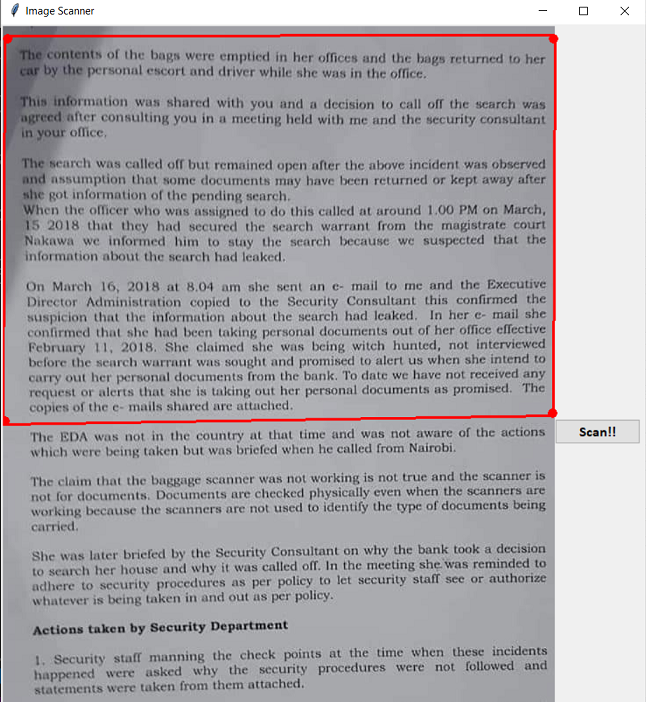
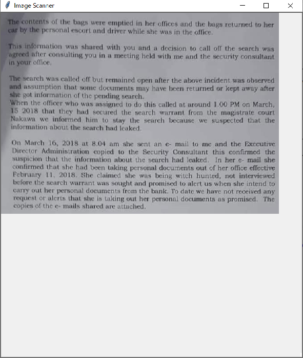
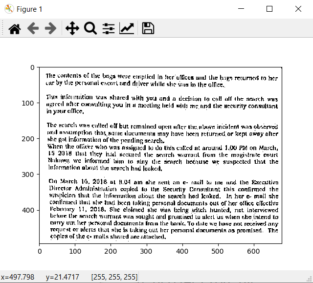

# Document-Scanner
Implementation of Document Scanning using tkinter and opencv. <br>
Simpler version of CamScanner. <br>
Automatic edge detection yet to be implemented. But users will be able to selected the region of interest interactively. <br>

# Requirements
Tkinter 8.6 <br>
OpenCV 4.2.0 <br>


# Steps to run
1. Run main.py <br>
```.bash
python main.py
```
2. Select box to be scanned. Hit Scan!! <br>
3. Scanned Image gets displayed.

# Example 
1. Select Region of Interest. Click Scan!! <br>
 <br><br>
2. Perspective Projection of selected ROI. <br>
 <br><br>
3. Scanned Image. <br>
 <br><br>
If you get any ideas to further enhance the output, please feel free to reach out!!<br>
